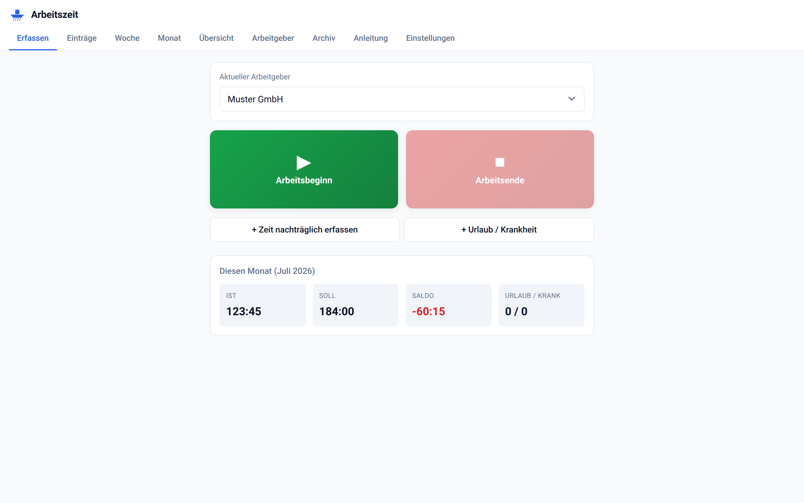
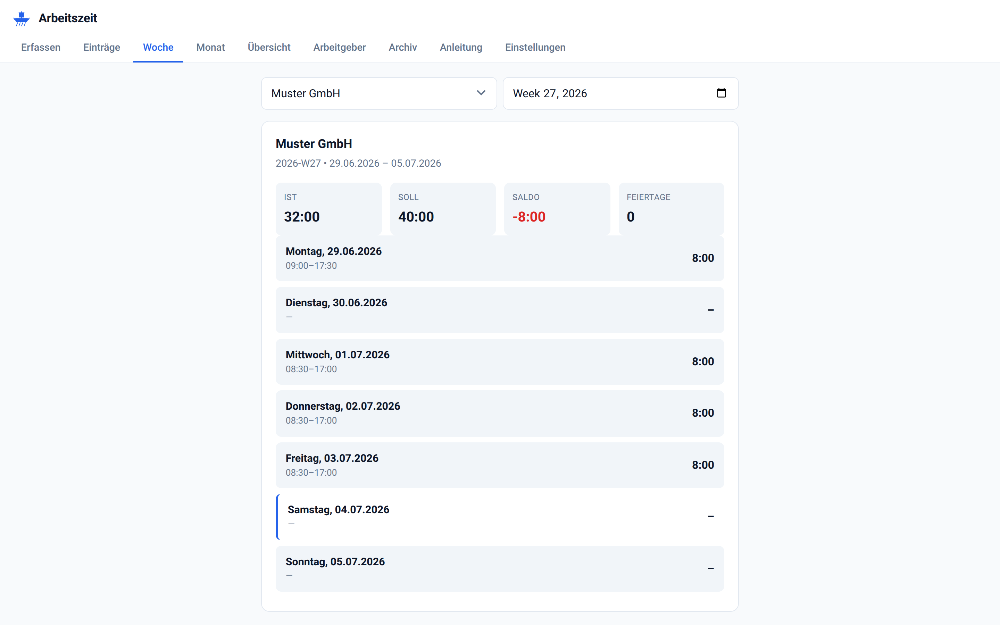
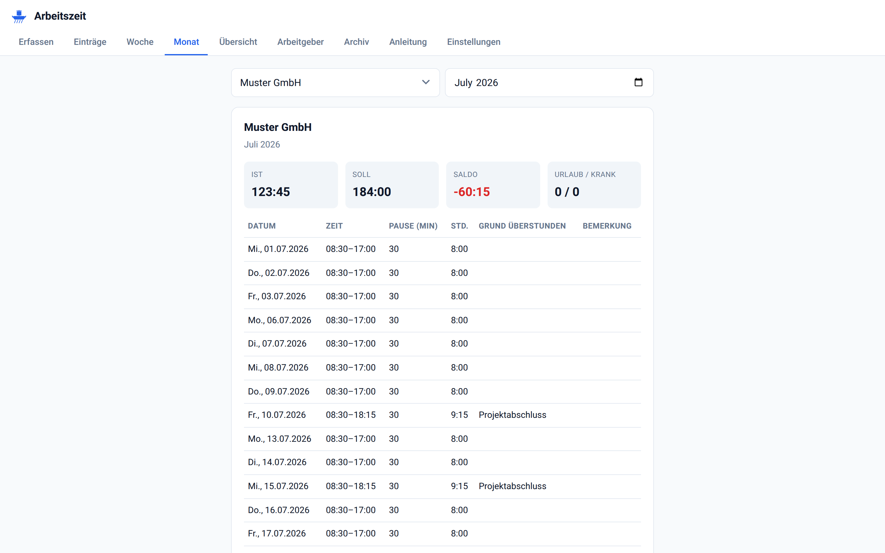
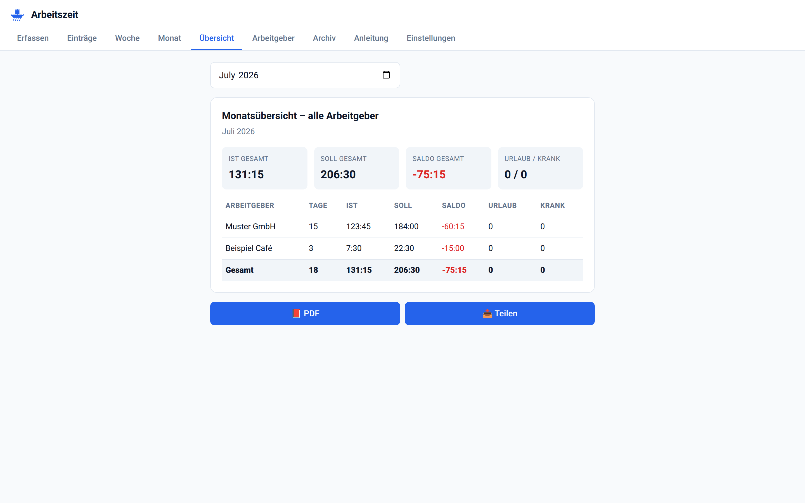
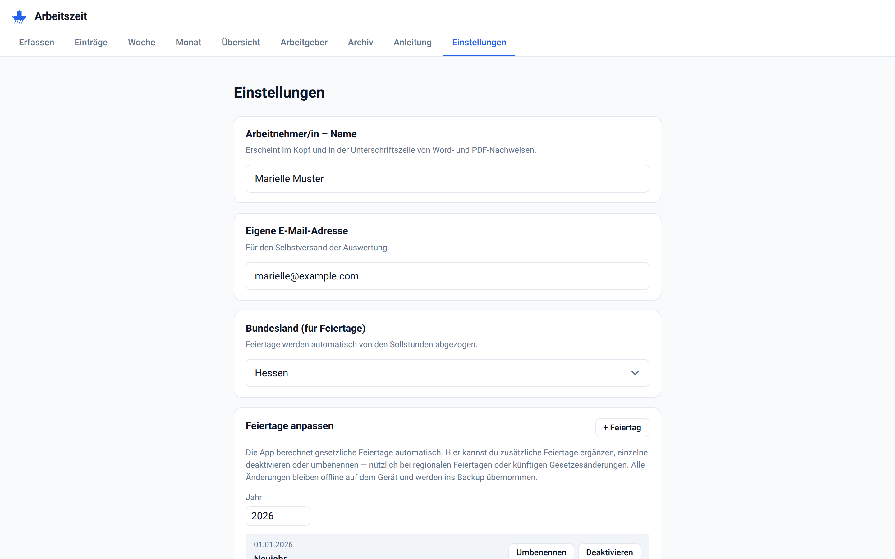
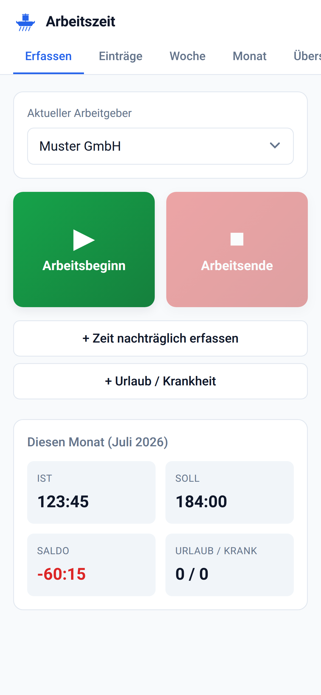
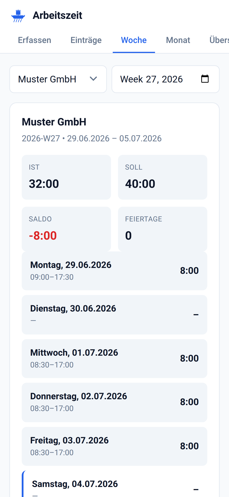
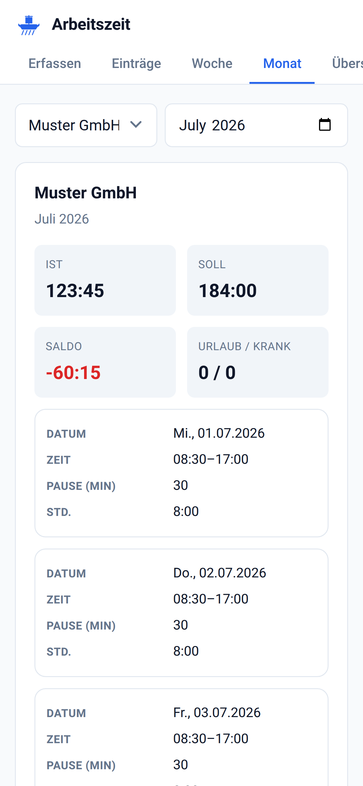
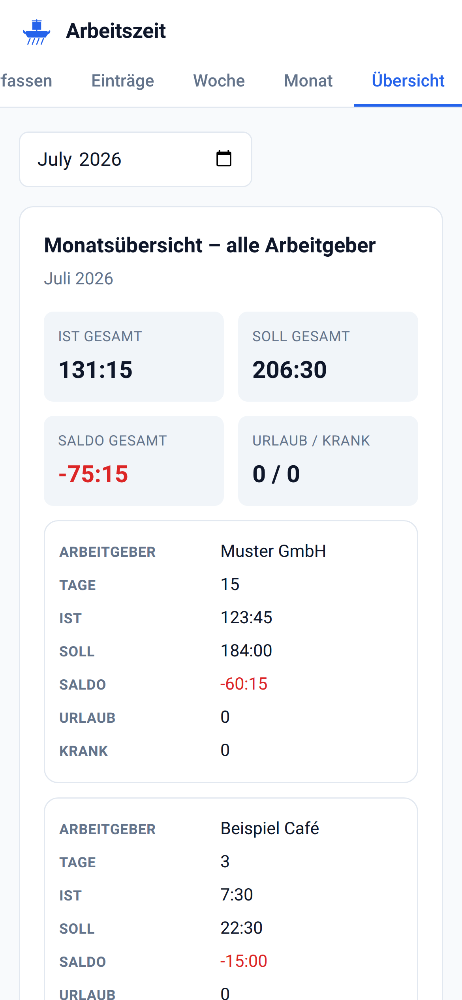
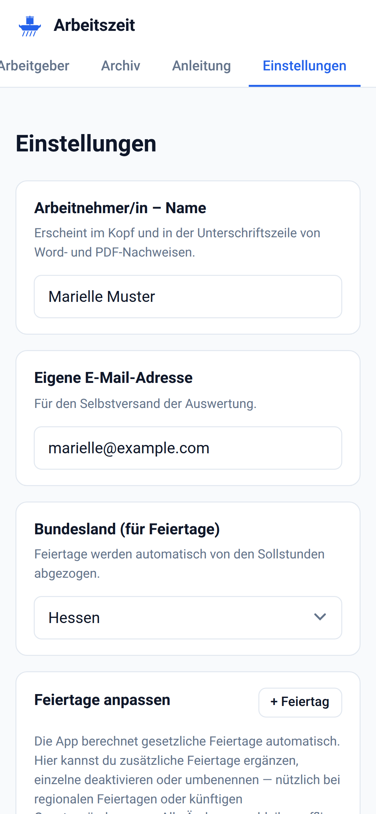

# Arbeitszeiterfassung

Offline-fähige Progressive Web App zur Erfassung von Arbeitszeit mit mehreren Arbeitgebern, Monatsübersicht, PDF-Export und rechtssicheren Pausen- und Feiertagsregeln für Deutschland.

**Live-App:** https://ollies-spielwiese.github.io/Arbeitszeiterfassung/

## Was die App kann

- Zeiterfassung per Start-/Stopp-Taste oder nachträglich per Formular
- Mehrere Arbeitgeber parallel mit unterschiedlichen Sollstunden und Zeitplänen
- Wöchentliche und monatliche Übersichten mit Soll/Ist/Saldo
- Übersichts-Tab: alle Arbeitgeber im Monatsvergleich
- PDF-Export einzelner Monatsberichte und der Übersicht
- Feiertage für alle Bundesländer, inklusive nachträglicher Anpassung (deaktivieren, umbenennen, ergänzen)
- Urlaubs- und Krankheitstage separat erfasst und im Saldo berücksichtigt
- Vorlagen für häufige Überstundengründe
- Datensicherung als JSON-Export mit Wiederherstellung
- Läuft komplett offline. Keine Datenübertragung an Server. Alle Daten bleiben auf dem Gerät.

## Screenshots

### Desktop

**Erfassung**

**Wochenübersicht**

**Monatsbericht**

**Monatsübersicht aller Arbeitgeber**

**Einstellungen**

### Mobil

Auf iPhone und Android installiert als Home-Screen-App.

| Erfassung | Woche | Monat |
|---|---|---|
|  |  |  |

| Übersicht | Einstellungen |
|---|---|
|  |  |

## Installation

### iPhone / iPad

1. https://ollies-spielwiese.github.io/Arbeitszeiterfassung/ in Safari öffnen
2. Teilen-Icon unten in der Leiste antippen
3. „Zum Home-Bildschirm" wählen
4. Namen bestätigen, dann „Hinzufügen"

Das App-Icon liegt jetzt auf dem Homebildschirm und öffnet die App im Vollbildmodus. Sie funktioniert auch ohne Internet, sobald sie einmal geladen wurde.

### Android

1. https://ollies-spielwiese.github.io/Arbeitszeiterfassung/ in Chrome öffnen
2. Menü oben rechts (drei Punkte) antippen
3. „Zum Startbildschirm hinzufügen" wählen
4. Bestätigen

### Desktop

Im Chrome oder Edge auf das Installations-Icon in der Adressleiste klicken oder über das Menü „App installieren" wählen.

## Technischer Stack

- Reines HTML, CSS, JavaScript. Keine Frameworks, keine Build-Pipeline.
- Service Worker mit Cache-First-Strategie für Offline-Betrieb.
- Speicherung ausschließlich in `localStorage` des Browsers.
- Feiertagsberechnung nach Gauß'scher Osterformel, keine externen Datenquellen.
- Auto-Update: Beim Deployment einer neuen Version erscheint in der geöffneten App ein Banner „Neue Version verfügbar", das nach einem Klick den Cache leert und die App neu lädt.

## Datenschutz

Keine Server-Kommunikation, keine Analytics, keine Cookies, kein Tracking. Die App verlässt nach dem ersten Laden den Browser nicht. Backups sind manuell als JSON-Datei möglich und werden vom Nutzer selbst gespeichert.

## Release-Prozess

Siehe [RELEASE.md](RELEASE.md) für Deploy-Kommandos, Versions-Schema und Rollback.

## Autor

Oliver Gläser · Frankfurt am Main

## Lizenz

Nutzung frei für nichtkommerzielle Zwecke. Kein Support-Anspruch.
